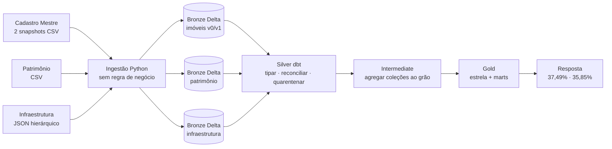
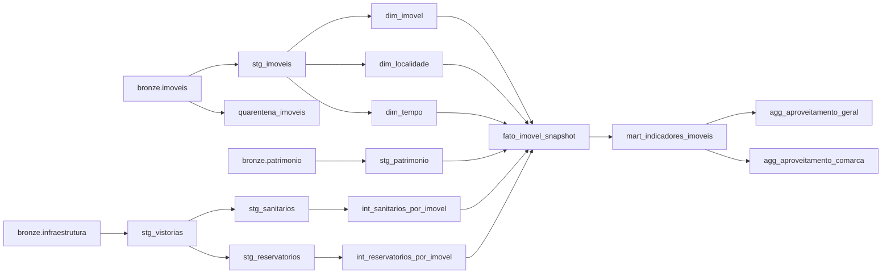
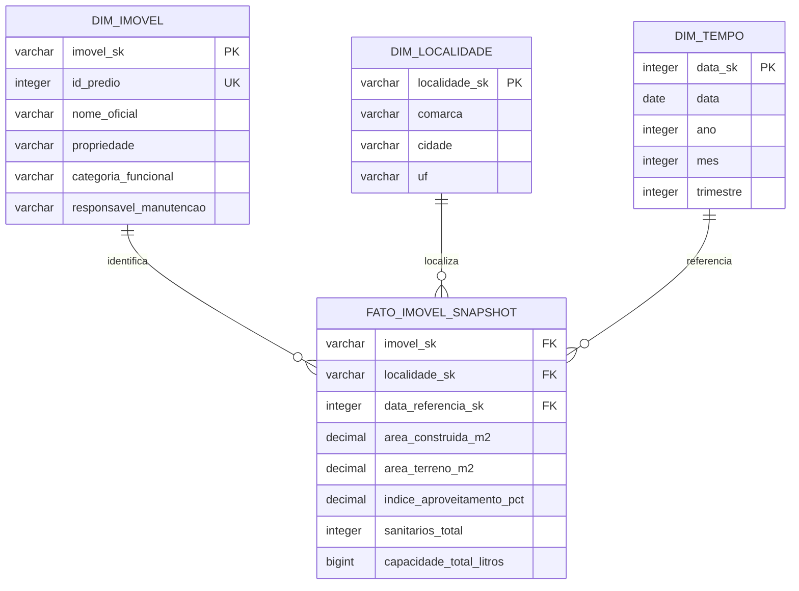

# Arquitetura e linhagem

## Jornada do dado

## DAG lógica

O grafo oficial da execução é o gerado por `dbt docs`. Este desenho é uma explicação
manual e deve ser conferido contra o `manifest.json` quando a DAG mudar.

## Estrela da Gold

